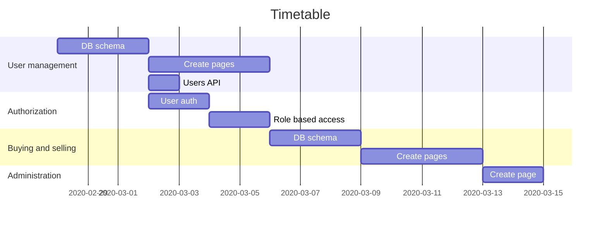

**_Welcome to the home of your group's TIETA12, part 2 coursework code and documentation!_**

This README.md file is where your group writes your project plan/project report.

When you write it, you must use Markdown. [Documentation for GitLab Flavored Markdown (GFM)](https://docs.gitlab.com/ee/user/markdown.html).

The directory structure of the code is up to your group to decide, but this README.md file must remain in place.

# Running the project

1. `config.vm.network "forwarded_port", guest: 5000, host: 5000` needs to be added to Vagrantfile.
2. `npm install` in root folder
3. `npm install` in root/backend folder
4. `npm install` in root/client folder
5. `npm run dev` in root folder

# Initial project plan document

The headers that must be present in this document are shown here.

For instructions on what to add under these headers, [see the coursework assignment document](https://docs.google.com/document/d/1ctG6mURrs1WlqwwPnMOFE_mSIEhZVCjp2XGefAZMdxQ/edit#heading=h.vsanic5plbto)

## Course project group information

### Group 404 members

- Miika Johansson, 427655, miika.johansson@tuni.fi
- Juho Lehtimäki, 425097, juho.a.lehtimaki@tuni.fi
- Topi Nieminen, 424727, topi.nieminen@tuni.fi

[GitLab Repository](https://course-gitlab.tuni.fi/tieta12-2019-2020/404/tree/master)

## Planned functionality

The initial deadlines and description of functionalities are listed in the table below.

| Functionality            | Description                                                                                                                   | Deadline |
| ------------------------ | ----------------------------------------------------------------------------------------------------------------------------- | -------: |
| User management          | Login/logout, editing info, deleting user account, viewing list of users (for admin users)                                    |     8.3. |
| Authorization            | Implement authorization and user role based access to APIs                                                                    |     8.3. |
| Buying and selling items | Users can create offers that shopkeepers can view. Shopkeepers list items that unregistered users can view and users can buy. |    15.3. |
| Administration           | Implement tools for administrating users, offers and items.                                                                   |    20.3. |

[The Issue Board](https://course-gitlab.tuni.fi/tieta12-2019-2020/404/-/boards) contains sub-tasks that are created from the major tasks.

Work is divided between the group members using the issue board.

Each member chooses an issue needed for the next major task to work on. Upon completing an issue a new issue is picked.

### Task overview

1. User management
   - Create and implement user db schema
   - Create registration, login and editing pages
   - Create API for listing all users (for admins)
2. Authorization
   - Implement authorization of users
   - Implement role based access to APIs
3. Buying and selling items
   - Create and implement item db schema
   - Create pages for creating offers and listing offers and shopkeeper's items
4. Administration
   - Create a page where admins can view users and offers

## Pages and navigation

Pages for now, will be updated later on.


## Modules your group created in your Node project

```
root
├── README.md
├── backend
|   ├── models
|   |   ├── items.js
|   |   └── user.js
|   ├── node_modules
|   ├── routes
|   |   ├── api
|   |     ├── items.js
|   |     ├── login.js
|   |     └── users.js
|   ├── utils
|   ├── .gitignore
|   ├── app.js
|   └── package.json
└── client
    ├── node_modules
    ├── package.json
    ├── .gitignore
    ├── public
    │   ├── favicon.ico
    │   ├── index.html
    │   └── manifest.json
    └── src
        ├── components
        |   └── // All React components
        ├── redux
        |   ├── actions
        |   |   ├── itemAction.js
        |   |   └── loginAction.js
        |   ├── reducers
        |   |   ├── auth.js
        |   |   └── index.js
        |   ├── actionTypes.js
        |   └── store.js
        ├── App.css
        ├── App.jsx
        ├── App.test.js
        ├── index.css
        ├── index.js
        ├── logo.svg
        ├── serviceWorker.js
        └── setupTests.js
```

## Mongo database and Mongoose schemas

#### Notes

- Credit card information is not saved to the database. We focused less on the payment system because in a real scenario a 3rd party payment system would most likely be used eg. [Stripe](https://stripe.com/en-fi).
- Item description has a max length to limit exessive user inputs, which would decrease the performance of the database.
- Shopkeepers price items by adding a profit margin to the items.
- Items can have a status of pending, listed or sold.

### User

```javascript
const userSchema = new mongoose.Schema({
  email: {
    type: String,
    required: true,
    unique: true,
    minlength: 4
  },
  firstName: {
    type: String,
    required: true
  },
  lastName: {
    type: String,
    required: true
  },
  password: {
    type: String,
    required: true,
    minlength: 4
  },
  role: {
    type: String,
    required: false,
    default: "user"
  }
});
```

### Item

```javascript
const itemSchema = new mongoose.Schema({
  name: {
    type: String,
    required: true
  },
  description: {
    type: String,
    required: true,
    maxlength: 400
  },
  price: {
    type: Number,
    required: true
  },
  margin: {
    type: Number,
    default: schemaDefaults.margin.defaultValue,
    enum: schemaDefaults.margin.values
  },
  seller: {
    type: mongoose.Schema.Types.ObjectId,
    ref: "User"
  },
  buyer: {
    type: mongoose.Schema.Types.ObjectId,
    ref: "User"
  },
  shopkeeper: {
    type: mongoose.Schema.Types.ObjectId,
    ref: "User"
  },
  status: {
    type: String,
    trim: true,
    lowercase: true,
    default: schemaDefaults.status.defaultValue,
    enum: schemaDefaults.status.values,
    validate: {
      validator: val => {
        for (let i = 0; i < schemaDefaults.status.values.length; i++) {
          if (val === schemaDefaults.status.values[i] || val === "") {
            return true;
          }
        }

        return false;
      },
      message: `Status must be one of: "${schemaDefaults.status.values.join(
        '", "'
      )}"`
    }
  },
  dateAdded: {
    type: Date,
    default: Date.now
  },
  dateSold: {
    type: Date,
    required: false
  }
});
```

## API

To use the API the user must first login via /api/login to get a JWT token. All routes except POST to /api/users and /api/login require the use of the token.
Include the token by adding the header `Authorization: Bearer {JWT token}` to requests.

### GET routes

| HTTP route     | Description                           | Allowed users                     |
| -------------- | ------------------------------------- | --------------------------------- |
| /api/users     | Fetches the list of all users         | admin                             |
| /api/users/:id | Fetches a single user according to id | admin, user with corresponding id |
| /api/items     | Fetches the list of all items         | everyone                          |
| /api/items/:id | Fetches a single item                 | everyone                          |

### DELETE routes:

| HTTP route     | Description           | Allowed users                     |
| -------------- | --------------------- | --------------------------------- |
| /api/users     | Deletes all users     | admin                             |
| /api/users/:id | Deletes a single item | admin, user with corresponding id |
| /api/items     | Deletes all items     | admin                             |
| /api/items/:id | Deletes a single item | admin, shopkeeper                 |

### POST & PUT routes with required data:

| HTTP route                                                                                                        | Description                | Allowed users                     |
| ----------------------------------------------------------------------------------------------------------------- | -------------------------- | --------------------------------- |
| /api/login with body: {"email": "email@test.com", "password": "secret"}                                           | Login & retrieve JWT token | everyone                          |
| /api/users with body: {"email": "email@test.com","firstname": "Foo", "lastname": "Bar", "password": "secret"}     | Create user                | everyone                          |
| /api/users/:id with body: {"email": "email@test.com","firstname": "Foo", "lastname": "Bar", "password": "secret"} | Edit user                  | admin, user with corresponding id |
| /api/items with body: {"name" : "test item", "description": "test", "price": 5}                                   | Create item                | admin, shopkeeper, user           |
| /api/items/:id with body: {"name" : "test item", "description": "test", "price": 5}                               | Edit item                  | admin, shopkeeper, user           |

### HATEOAS

HATEOAS will be implemented by simply including links related to the resource object.

```JSON
{
  ...
  links: [
    "self": "http://localhost:3000/api/users/1"
  ]
}
```

## React and Redux

In this group work we use React with [Create React App](https://github.com/facebook/create-react-app#create-react-app--)

Redux will be used with React as the state container.

## Testing

Testing was done manually using Postman.

Automated tests will be written if time allows.

## Project timetable and division of work



_Good luck and happy WWWdevvin’!_
