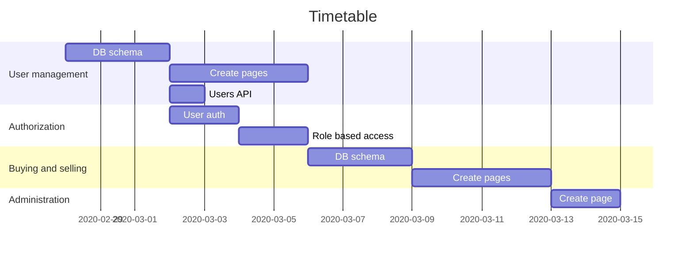

**_Welcome to the home of your group's TIETA12, part 2 coursework code and documentation!_**

This README.md file is where your group writes your project plan/project report.

When you write it, you must use Markdown. [Documentation for GitLab Flavored Markdown (GFM)](https://docs.gitlab.com/ee/user/markdown.html).

The directory structure of the code is up to your group to decide, but this README.md file must remain in place.

# Initial project plan document

The headers that must be present in this document are shown here.

For instructions on what to add under these headers, [see the coursework assignment document](https://docs.google.com/document/d/1ctG6mURrs1WlqwwPnMOFE_mSIEhZVCjp2XGefAZMdxQ/edit#heading=h.vsanic5plbto)

## Course project group information

### Group 404 members

- Miika Johansson, 427655, miika.johansson@tuni.fi
- Juho Lehtimäki, 425097, juho.a.lehtimaki@tuni.fi
- Topi Nieminen, 424727, topi.nieminen@tuni.fi

[GitLab Repository](https://course-gitlab.tuni.fi/tieta12-2019-2020/404/tree/master)

## Planned functionality

The initial deadlines and description of functionalities are listed in the table below.

| Functionality            | Description                                                                                                                   | Deadline |
| ------------------------ | ----------------------------------------------------------------------------------------------------------------------------- | -------: |
| User management          | Login/logout, editing info, deleting user account, viewing list of users (for admin users)                                    |     8.3. |
| Authorization            | Implement authorization and user role based access to APIs                                                                    |     8.3. |
| Buying and selling items | Users can create offers that shopkeepers can view. Shopkeepers list items that unregistered users can view and users can buy. |    15.3. |
| Administration           | Implement tools for administrating users, offers and items.                                                                   |    20.3. |

[The Issue Board](https://course-gitlab.tuni.fi/tieta12-2019-2020/404/-/boards) contains sub-tasks that are created from the major tasks.

Work is divided between the group members using the issue board.

Each member chooses an issue needed for the next major task to work on. Upon completing an issue a new issue is picked.

### Task overview

1. User management
   - Create and implement user db schema
   - Create registration, login and editing pages
   - Create API for listing all users (for admins)
2. Authorization
   - Implement authorization of users
   - Implement role based access to APIs
3. Buying and selling items
   - Create and implement item db schema
   - Create pages for creating offers and listing offers and shopkeeper's items
4. Administration
   - Create a page where admins can view users and offers

## Pages and navigation
Pages for now, will be updated later on.


## Modules your group created in your Node project

```
root
├── README.md
├── server
|   ├── node_modules
|   ├── package.json
|   ├── Server.js
|   └── models
|       ├── user.js
|       └── item.js
└── client
    ├── node_modules
    ├── package.json
    ├── .gitignore
    ├── public
    │   ├── favicon.ico
    │   ├── index.html
    │   └── manifest.json
    └── src
        ├── App.css
        ├── App.js
        ├── App.test.js
        ├── index.css
        ├── index.js
        ├── logo.svg
        └── serviceWorker.js
```

## Mongo database and Mongoose schemas

### User

```javascript
const userSchema = new Schema({
  email: {
    type: String,
    required: true
  },
  firstName: {
    type: String,
    required: true
  },
  lastName: {
    type: String,
    required: true
  },
  password: {
    type: String,
    required: true
  },
  role: {
    type: String,
    required: true
  }
});
```

#### Notes

- Use email as username
- Mail address required?
- Credit card information saved to db?
- Separate schema/collection for passwords?
- Separate schem/collection for roles?

### Item

```javascript
const itemSchema = new Schema({
  name: {
    type: String,
    required: true
  },
  description: {
    type: String,
    required: true,
    maxlength: 400 // hardcoded length or no?
  },
  price: {
    // Different prices?
    type: Number,
    required: true
  },
  owner: {
    // Reference to user-schema
    type: ObjectId,
    ref: "User",
    required: true
  },
  status: {
    // TODO
    type: String,
    required: true
  },
  dateAdded: {
    type: Date,
    required: false // or true?
  },
  dateSold: {
    type: Date,
    required: false
  }
});
```

#### Notes

- Hardcoded name, description lengths or no?
- Multiple prices for same item? (shopkeeper profit vs seller)
- Link to user schema TODO
- status: SOLD / WAITING-FOR-APPROVAL etc. needs design
- dateAdded, dateSold needed?

## API

REST backend with routes, responses are send in JSON format:

GET routes:
- /api/users - fetches list of all users
- /api/users/:id - fetches a single user
- /api/items - fetches a list of all items
- /api/items/:id - fetches a single item

DELETE routes:
- /api/users - deletes all users
- /api/users/:id - deletes a single user
- /api/items - deletes all items
- /api/items/:id - deletes a single item

POST & PUT routes:
- /api/users with body: {"email": "email@test.com","firstname": "Foo", "lastname": "Bar", "password": "secret", role: "admin"}
- /api/items with body: {"name" : "test item", "description": "test", "price": 5, "owner": "owner1", "status": "pending",  "dateAdded": null, "dateSold": null}
- /api/users/login with body: {"email": "email@test.com", "password": "secret"}
- /api/users/register with body: {"email": "email@test.com","firstname": "Foo", "lastname": "Bar", "password": "secret"}

### HATEOAS
HATEOAS will be implemented by simply including links related to the resource object.
```JSON
{
  ...
  links: [
    "self": "http://localhost:3000/api/users/1"
  ]
}
```
## React and Redux

In this group work we use React with [Create React App](https://github.com/facebook/create-react-app#create-react-app--)

Redux will be used with React as the state container.

## Testing

Testing will be done manually.

Automated tests will be written if time allows.

## Project timetable and division of work



_Good luck and happy WWWdevvin’!_
